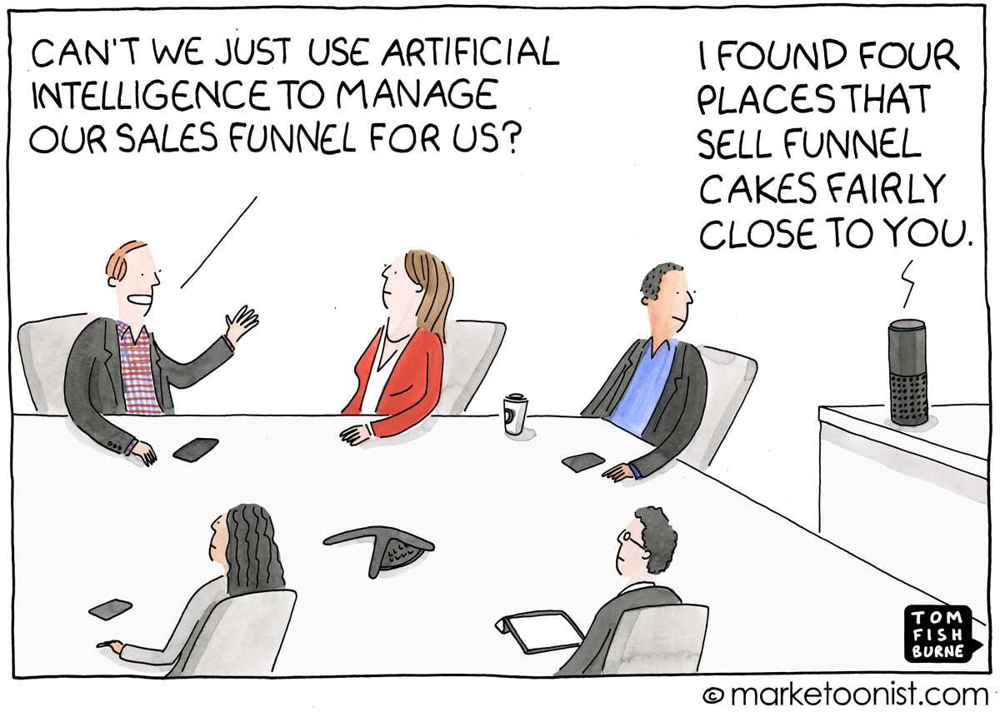

# Index 

- [No Plan Survives Contact With the Enemy](#No-Plan-Survives-Contact-With-the-Enemy)
- [Reality Check](#Reality-Check)
- [I Want to Be Data Driven When I Grow Up](#I-Want-to-Be-Data-Driven-When-I-Grow-Up)
- [The Problem of Siloed and Segregated Data](#The-Problem-of-Siloed-and-Segregated-Data)
- [Signal and Noise](#Signal-and-Noise)
- [Managing Expectations](#Managing-Expectations)

**Disclaimer!**

This guide is intended to alert you to possible disappointing job offers, internships, real-world project collaborations.

It is in no way intended to be representative of the work environment or the people you will meet, but **Virgilio wants you to see what the worst-case scenario would look like.**

## No Plan Survives Contact With the Enemy

**Congratulations!**

If you are reading these words, you are probably back from _months and months_ (or years) of studying through the various resources of the Purgatorio, and have familiarized yourself with most of the concepts explored, and experienced some of them on datasets found around. 

You may have built some small Data Science project on GitHub to showcase, and you started applying for some Data Science internships or positions.  

Gaining confidence from the months (or years) of **study + practice** you've done, you accept the first internship you're offered. 

_Fast forwards a few weeks:_

You're very disappointed, the job is not what you expected, not at all! 

The first day of work, your boss gives you a "dataset" that a client gave him, and asks you to get "**an AI who understands how to make them useful**" (what?!?).

The dataset has a lot of missing values, the column names are flimsy and nobody explained how to interpret them. Exploring those messy data you find that the column to predict has half the missing values, and the other columns have enough noise to make them unusable.

So this dataset, with your actual knowledge, is almost unusable!

Moreover, **the salesmen were definitely not aligned on the current possibilities of Artificial Intelligence** (as they call predictive models to sell them at higher price :D), and they promised the moon!

---

Sad and desolate you take the negative comments of your boss, who thinks that you don't know how to do anything.

What went wrong? Wasn't everything as rosy as you thought?

It's everything fine, you just need some **reality check.** 

::: tip
If you've ever had a situation like this, well, it's probably better if you move away from such a boss). 
:::

## Reality Check

For sure you've heard that [Data Scientist isThe Sexiest Job of the 21st Century](https://hbr.org/2012/10/data-scientist-the-sexiest-job-of-the-21st-century), and a lot of articles and blogs describes the Data Scientist daily job as a walk in the park, without messiness and effort.

**The inconvenient truth is completely different, and here are some reasons:**

- Most of the Scientist daily time [is related to ETL](https://www.quora.com/What-is-an-average-work-day-for-a-data-scientist) (Extract, Transform, and Load Data), not the funniest thing ever.
- Real-world datasets are almost never complete, clean, well aggregated ([Machine learning isn't Kaggle competitions](http://jvns.ca/blog/2014/06/19/machine-learning-isnt-kaggle-competitions/)).
- You don't have someone explaining how they were built or what to expect inside them (like a Kaggle "data explanation" section). 
- Often the datasets you are provided with contain a lot of noise, and it is vital to know what to discard. 
- Everyone is [expecting you to do fancy magic with data](https://www.reddit.com/r/datascience/comments/3m78k1/i_hire_data_scientists_this_is_the_stuff_this/), maybe they expect you to build a super-intelligent AI to fire employees and take over the world.

Okay, maybe the last one's a joke... or not! 

In fact, since there is a huge hype around the field of Data Science, **the expectations** of those who allocate the company budget to this topic are also very high!

See:

- [Here’s why so many data scientists are leaving their jobs](https://towardsdatascience.com/why-so-many-data-scientists-are-leaving-their-jobs-a1f0329d7ea4)

::: warning 
That **doesn't mean** you have to be discouraged, it just means you have to have the right expectations! With the right expectations and premises, the work of Data Scientist is _challenging, satisfying and creates enormous value for those who use it!_
:::

These common data-related problems are adressed in specific in the next sections.

## I Want to Be Data Driven When I Grow Up

Companies, although rational and profit-driven structures, are entities composed of humans, who are by their nature influential and emotional. This means that some of the factors that influence the decisions made in a company are totally irrational, dictated by emotions. 

One decision a company can make is to push for innovation, and *that is good!*

But it can happen that those who have to deal with innovation decisions are at best ignorant about it, and at worst reluctant to change!

So what happens? 

That often (human emotions) you get carried away by buzz-words, by themes around which there is Hype, without really understanding them or understanding if they can really bring value. 
This process often leads many organizations to want to call themselves ["data-driven"](https://www.cio.com/article/3449117/what-exactly-is-a-data-driven-organization.html), when they don't really know what it means / what it could be used for!

Often this kind of statement is also partly for advertising purposes... 

Also Relevant:

 

### **The bottom line:**

Be careful when you talk to a "data-driven" company, do they really know what they're talking about? Ask yourself, for example:

- how does data impact the business?
- is there a dedicated Data Science team?
- are they aware of the real possibilities of predictive models that exploit data?
- How much does being data-driven affect the company's marketing? 

Read this very good Reddit thread about building real data-driven businesses:

- [How to create a ‘data driven’ business?](https://www.reddit.com/r/datascience/comments/eecg2k/how_to_create_a_data_driven_business/)

- [3 Challenges Companies Face in Becoming Data Driven]()

## The Problem of Siloed and Segregated Data
## Signal and Noise
## Managing Expectations

